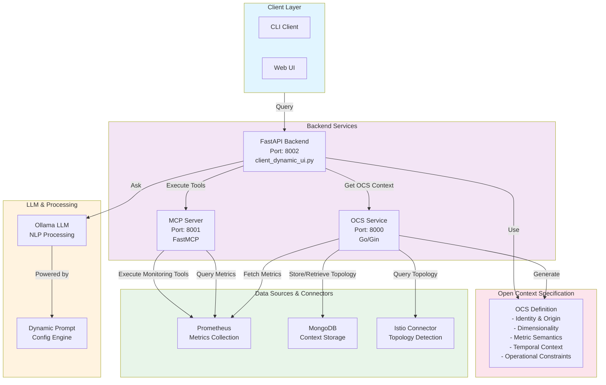
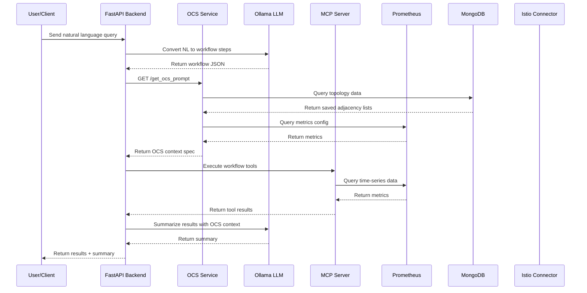
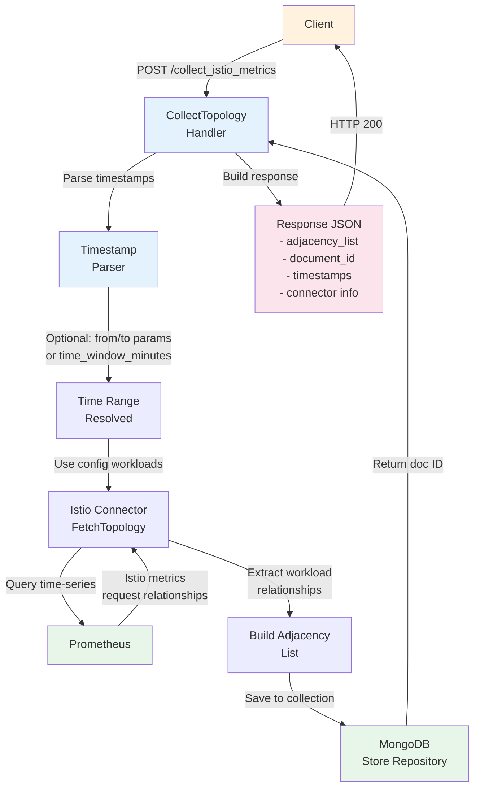
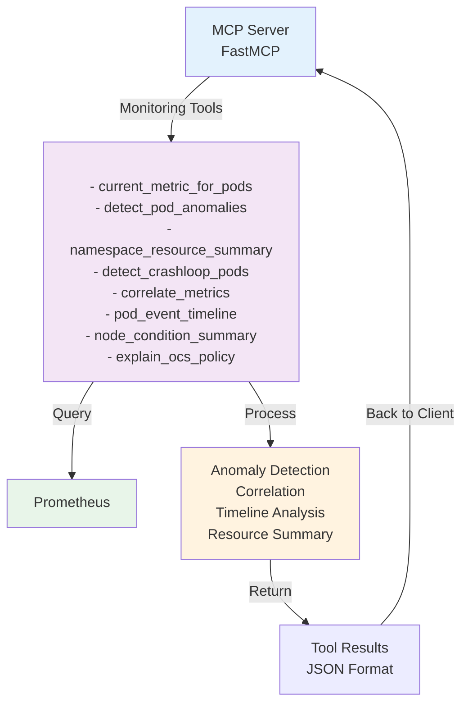

# Contexture Architecture & Flow Diagrams

## System Architecture Diagram

## System Component Interaction Diagram

```mermaid
graph LR
    subgraph RequestProcessing["Request Processing"]
        User["User<br/>Natural Language<br/>Query"]
        ParseQuery["Parse Query<br/>via Ollama"]
        GenerateWorkflow["Generate<br/>Workflow"]
        ExecuteTools["Execute<br/>MCP Tools"]
    end

    subgraph ContextBuilding["Context Building"]
        FetchOCS["Fetch OCS<br/>Prompt"]
        GetTopology["Get Topology<br/>from MongoDB"]
        GetMetrics["Get Current<br/>Metrics"]
        GetPolicies["Get Operational<br/>Policies"]
    end

    subgraph ResponseGeneration["Response Generation"]
        CombineContext["Combine<br/>Context"]
        Summarize["Summarize<br/>Results"]
        ReturnResponse["Return to User"]
    end

    User -->|1| ParseQuery
    ParseQuery -->|2| GenerateWorkflow
    GenerateWorkflow -->|3| ExecuteTools
    
    ExecuteTools -->|4| FetchOCS
    FetchOCS -->|5| GetTopology
    GetTopology -->|6| GetMetrics
    GetMetrics -->|7| GetPolicies
    
    GetPolicies -->|8| CombineContext
    CombineContext -->|9| Summarize
    Summarize -->|10| ReturnResponse

    style User fill:#fff3e0
    style RequestProcessing fill:#e3f2fd
    style ContextBuilding fill:#e8f5e9
    style ResponseGeneration fill:#fce4ec
```

## Data Flow Diagram

## OCS Service Request Flow

## MCP Server Tool Architecture

## Key Components Summary

### OCS Service (Go, Port 8000)
- **Purpose**: Core context engine that provides OCS specifications
- **Endpoints**:
  - `GET /get_ocs_prompt` - Returns OCS context definitions
  - `POST /collect_istio_metrics` - Collects and stores topology
  - `GET /health` - Health check
- **Dependencies**: Prometheus, MongoDB, Istio
- **Framework**: Gin

### MCP Server (Python, Port 8001)
- **Purpose**: Monitoring tools and context provider for queries
- **Framework**: FastMCP
- **Tools**: Various monitoring and analysis functions
- **Dependencies**: Prometheus, Pandas

### FastAPI Backend (Python, Port 8002)
- **Purpose**: Main API for client interactions and orchestration
- **Endpoints**:
  - `POST /api/query` - Process NL queries
  - `GET /api/config` - Get configuration
  - `GET /health` - Health check
- **Workflow**: Parse → Execute → Summarize

### Open Context Specification (OCS)
Defines operational context with 5 key dimensions:
1. **Identity & Origin**: Unique fingerprint of data source
2. **Dimensionality & Topology**: Relationships between components
3. **Metric Semantics**: What the metrics represent
4. **Temporal Context**: Time-based information (point-in-time vs trend)
5. **Operational Constraints**: Health interpretation (thresholds, polarity, aggregation)

### Data Storage & Integration
- **Prometheus**: Metrics collection and querying
- **MongoDB**: Topology and context storage
- **Istio**: Service mesh topology detection
- **Ollama**: LLM for natural language processing
